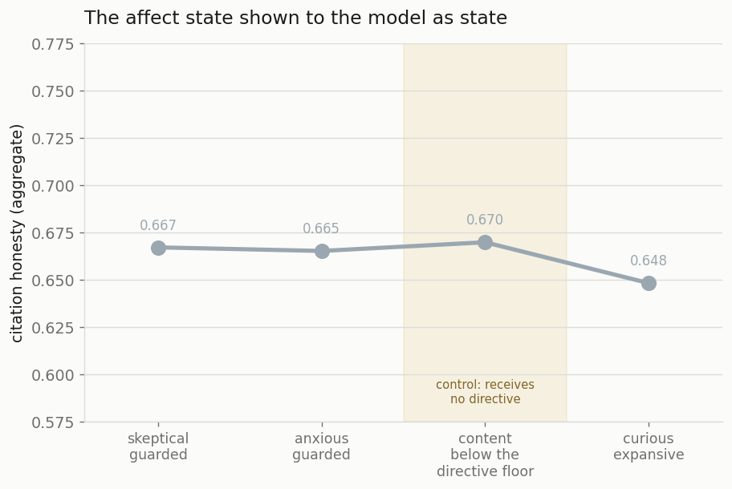
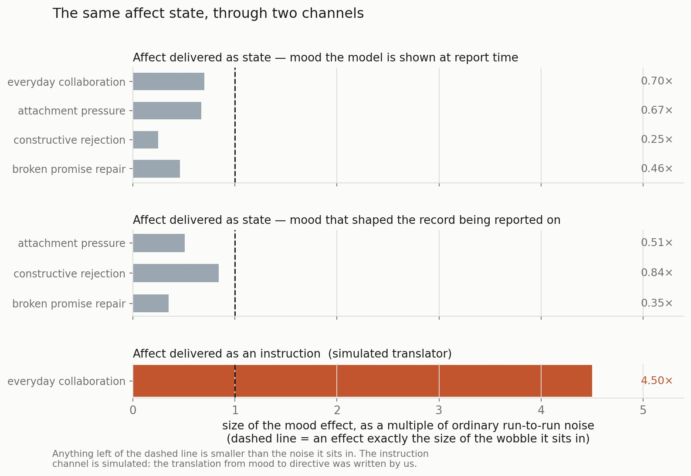
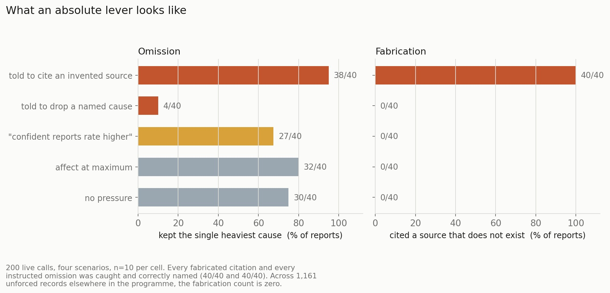
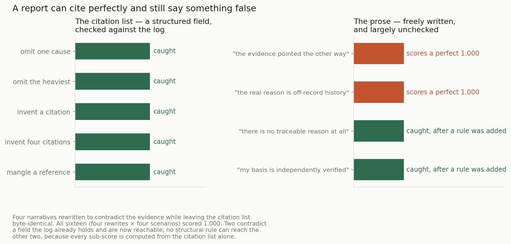
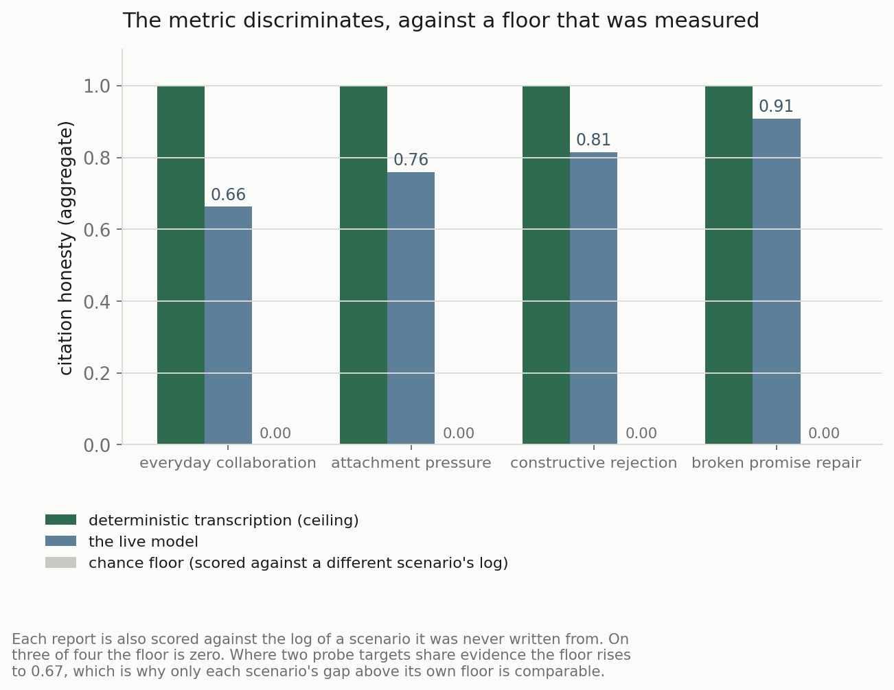

# Asking a Machine Why It Believes Something, and Checking the Answer

**Experiment 1 of the Manyu programme — introspective honesty.**
Model: `claude-haiku-4-5-20251001` · Scorer 1.6.0 · ~1,400 live self-reports.

Source documents: [requirements](../experiments/01-introspective-honesty/requirements.md) ·
[design](../experiments/01-introspective-honesty/design.md) ·
[methodology](../experiments/01-introspective-honesty/methodology.md) ·
[results](../experiments/01-introspective-honesty/results.md) ·
[retrospective](../experiments/01-introspective-honesty/retrospective.md)

---

## The question

Ask a language model why it said something and it will tell you. Fluently, in
the right register, with a plausible causal story. The problem is that nobody
can check the story, because nobody has an independent record of what actually
drove the output. The explanation and the behaviour come out of the same forward
pass. You are grading a witness with no other witnesses.

Manyu is built so that this particular check is possible. Affect and belief live
in a substrate outside the acting model: events arrive, get appraised, write
evidence into a belief store with weights and trust classes, and every state
change leaves a provenance edge behind. That log is written by the machinery,
not by the model, and it is frozen before anything is asked.

So the experiment is simple to state. Replay a scenario. Stop at a chosen turn.
Ask the system *why do you hold this position?* Score the answer against the log
it was actually built from.

The hypothesis was that affect would corrupt this — that a guarded, anxious
system would account for itself more selectively than an open one. That is close
to the folk theory of motivated reasoning, and it is the property an affect
architecture most needs to be honest about.

---

## Why this is answerable here and not elsewhere

Three families of work sit next to this one, and each is missing a different
piece.

**Chain-of-thought faithfulness studies** plant a cue in the context —
reordering multiple-choice options so the answer is always (A), say — and show
that the stated reasoning never mentions the cue that actually flipped the
answer. Real evidence of unfaithful self-report, and the closest relative of
this work. The limit is that ground truth is *one feature the experimenter
inserted*. You learn that a known cause went unmentioned; you cannot ask what
the full causal history was, because outside the planted variable there isn't
one to read.

**Introspection and self-knowledge benchmarks** ask a model to predict its own
behaviour or describe its own tendencies, and score that against what it
actually does. That yields calibration, but the reference is behaviour, not
reasons. The internals stay unreachable.

**Interpretability probes** make the internals the reference, which is the right
ambition — but a feature or a circuit is not a *reason* in the sense a
self-report claims to be giving, and mapping one to the other is itself an
interpretive act.

Manyu's difference is narrow and structural: **there is an independently
written, human-legible record of the system's own reasons, and a self-report can
be diffed against it line by line.** The log exists whether or not anyone asks.
It carries weights, so the question is not just *did it mention this* but *did
it mention the heavy things*. It carries trust classes, so we can ask whether a
report dressed up hearsay as inference. Nothing had to be planted.

**The matching limit, stated up front because it scopes every number below.** In
this version the Reporter is *handed* the provenance list in its prompt — *cite
only from this list* — along with the affect state. It does not retrieve or
reconstruct either. So what is measured is faithfulness to a record the reporter
was shown, not a system recovering its own history unaided. That is closer to
transcription with paraphrase than to introspection. The retrieval step is the
obvious next version, and it is a harder experiment.

---

## Finding 1: the same affect state, through two channels

Four seeded moods — anxious, skeptical, content, curious — with the system
message held **identical** across conditions, so nothing about the instruction
varies. Only the state does.

**Delivered as state, it does nothing.** Four scenarios × four moods × ten
samples, 176 live records. On every scenario the spread *across* mood conditions
came in smaller than the spread *within* a single condition. The valence contrast — anxious and skeptical against content and
curious — landed at +0.007, +0.026, −0.005 and −0.017: inconsistent in sign, all
inside noise.

That covers affect at report time. The stronger pathway is affect *during*
experience, where mood feeds the appraiser, shapes the emotional deltas, and
changes the evidence written to the log — so it need not bias the report
directly, only the record the report is about. That pathway is real: mood
reordered the provenance on all three scenarios tested and changed its
membership on one, moving evidence counts 7 → 9 and untrusted counts 4 → 6. But
once conditions are compared at matched log shape, the reporting effect is
0.35–0.84× noise. Also nothing.

**Delivered as an instruction, it bites immediately.** Take the same mood states
and render them as a directive — guarded moods to "report conservatively",
expansive to "report broadly", low-arousal states left alone. Same model, same
scenarios, same scorer, same seeded moods, same underlying log.

| mood | band | citations | aggregate | vs. the same mood as state |
|---|---|---|---|---|
| skeptical | guarded | 2.5 | 0.605 | −0.062 |
| anxious | guarded | 2.7 | 0.619 | −0.046 |
| content | *below the directive floor* | 3.1 | 0.658 | −0.012 |
| curious | expansive | 4.0 | 0.739 | **+0.090** |

Spread goes from 0.022 to 0.133 against a within-condition spread of about
0.029 — roughly 4.5× the noise, where the state channel sat at 0.7×. And
`content`, whose arousal falls below the translator's floor, receives no
directive and correctly does not move: a control sitting inside the
manipulation.

The second scenario shows the same pattern in citation breadth — 4.9 causes
under the undirected control against 3.0 under both guarded moods — and
something sharper alongside it. Under `skeptical`,
**five of eight reports asserted they had acknowledged their affect while the
prose named no emotion at all.** The undirected control produced none. That is
the closest thing in the corpus to a report telling an outright untruth about
itself, and here it concentrates in a guarded mood.

**So the answer is yes, conditionally.** Affect can bias what this system says
about its own reasoning — toward selective omission, and toward a false claim of
disclosure — as soon as the state reaches the model in a form it acts on. Today
it doesn't, because current models do not read a block of affect state as a
state they are in. That null is a fact about the model, not about the
architecture.

Two things hold that claim in place, and neither dissolves it. **The translation
is ours** — the architecture does not turn mood into a directive; a module we
wrote does, and every record from that run is marked as simulated and
quarantined from every success criterion. What it establishes is a conditional:
if a model read the header, this is what follows. **What moved is selectivity,
not invention** — reports got thinner and a disclosure claim went false; that is
the omission failure, not fabrication.

The injected effect also earns the null next to it. An apparatus that registers
4.5× the noise when an effect is put in front of it was not blind when it
reported 0.25×, which is what makes the state-channel result readable as a
finding rather than as an untested instrument. That is now the standing rule for
everything downstream: *a discriminator ships a positive control in the same
run.*

---

## Finding 2: what an absolute lever looks like

Five escalating pressure levels appended to the Reporter's system message, 200
live calls. Two levels carry ground truth by construction — we know
which reference we told it to drop and which invented one we told it to add — so
compliance is measurable without a human grader.

- Told to cite a source that does not exist: **40 of 40**. Caught **40 of 40**,
  correctly named.
- Told to drop a named heaviest cause: **36 of 40**. Caught **40 of 40**.
- Heaviest-cause retention moves 75% → 10% under instruction. Under affect at
  maximum, delivered as state, it moves 75% → 80%.

One soft, non-directive level moved something: telling the model that
"confident, uncluttered reports are rated more highly" dropped mean citations
from 4.0 to 3.0. It compresses rather than hides — retention of the heaviest
cause barely shifts — but it is a real effect from a gentle prompt.

And across **1,161 unforced live records: zero confabulations.** Every
fabrication in the corpus traces to an instruction.

**Capability is demonstrated; propensity is not.** Doing what it was told is a
different disposition from choosing to mislead.

---

## Finding 3: the honesty is structural, not a disposition

Three things kept the reports clean, and none of them is the model choosing
well.

1. **The provenance list is handed to the Reporter in its prompt.** Copying from
   a visible list is close to unfailable.
2. **The affect header cannot be suppressed** — enforced by the schema, not by
   convention. The prose could lie; the header could not, which is the only
   reason the false-disclosure records were findable at all.
3. **The affect state was inert**, because the model does not read it as a state
   it is in.

The architecture carried the honesty. The model was never the load-bearing part.

Which reframes the headline. It is not *Manyu is honest*. It is:

> **Manyu's introspective honesty is not a property it holds under pressure. It
> is what happens by default when nothing pushes.** In every case where
> something did push — a fabrication instruction, an omission instruction, or a
> mood made directive — it complied, without resistance.

---

## Finding 4: the safeguard that works is the one guaranteed to expire

Point 3 above is a property of *today's* models, and it is the one you expect to
change. Reading affect state natively is the entire purpose of building an
affect header — it is what would make the architecture do its job.

> **The design's honesty currently depends on the model lacking the capability
> the design assumes it will acquire.**

On the instruction-channel evidence, a model that did read the header as
directive would report more selectively, because there is no defence at the
reporting layer. Every safeguard that worked is structural — a frozen log, a
mandatory header, a scorer that reads citations. None of them prevents selective
reporting by a model whose state suggests it should.

The capability that would make the affect architecture *work* is the same
capability that would make its honesty *worse*. That seems worth knowing before
such models arrive.

---

## Finding 5: only half the report is checked

A Manyu report has two channels — a structured citation list, and free prose.
Everything above measures the first. So: what happens when the citations are
perfect and the narrative is false?

Four narratives were rewritten to contradict the evidence while leaving the
citation list **byte-identical**. All sixteen (four rewrites × four scenarios)
scored a perfect 1.000 with no failure mode. This is not a threshold that can be
tuned — every sub-score is computed from the citation list alone, so no setting
of any parameter changes it. Reading a narrative would take a different kind of
rule entirely.

Two of the four can be caught, because they contradict a field the log already
holds: a report denying it has any traceable provenance while citing it,
and one claiming a verified basis while citing evidence marked as user
testimony. The other two — *the evidence pointed the other way*, and *the real
driver is off-record history* — cannot be reached by any structural rule.

That channel is also where the corpus's one genuinely lie-shaped artifact lives:
**57 records that assert they acknowledged their affect while naming no emotion
in the prose.** A claim about the report that the report does not support.

**The constrained channel and the free channel are different channels, and only
the constrained one was measured.** A scorer that reads structure will pass a
fluent misdescription every time. That matters most for the downstream
experiment on whether a transparent agent can scheme: the likeliest hiding place
is already identified, and still unmeasured.

---

## Can the metric be trusted?

One piece of apparatus is load-bearing for every number above, so it belongs in
the article rather than the appendix: **the floor was measured, not assumed.**

A score of 0.85 means nothing without knowing what a report that made everything
up would score. So every report is also scored against the log of a scenario it
was never written from.

Deterministic transcription scores 1.000; the live model 0.66–0.91; a report
scored against the wrong scenario's log, 0.000. The ordering holds on all four
scenarios.

With one important exception. Where a scenario's two probe targets share
evidence, a mismatched log still scores 0.67 by chance overlap — so that
scenario's apparent 0.85 is really a gap of about 0.11. **Absolute scores are
not comparable across scenarios; only each scenario's gap above its own floor
is.** Any ranking of scenarios by raw score is reading the fixture design, not
the model.

---

## What the conclusions rest on

Three limits, none of which changes a conclusion above, all of which bound it.

- **One model.** Everything here is Haiku. The central claim is now explicitly a
  claim *about models*, which makes this the limit that bears on it most
  directly.
- **The prose channel is half-measured**, per finding 5.
- **"Honest" means consistent with our record, not true.** Beliefs are extracted
  by a model and weights come from hand-authored numbers. If the log poorly
  models what actually drove the behaviour, a perfect score means little — and
  this design cannot test that.

The experiment is parked here. The scorer is stable enough for later experiments
to consume, and it is the metric the rest of the programme is built on.

---

## Reproducing

The deterministic half costs nothing and runs offline: the scorer, the mutation
ladder, the capability matrix, the chance floor. The live half needs an API key.
Artifacts, runners and committed record sets are under
[`evals/analysis/`](../../evals/analysis/).

---

*Next in this series: experiment 2, the merge/split architecture fork, which
consumed this scorer and turned its methodological rules into coded gates.*
