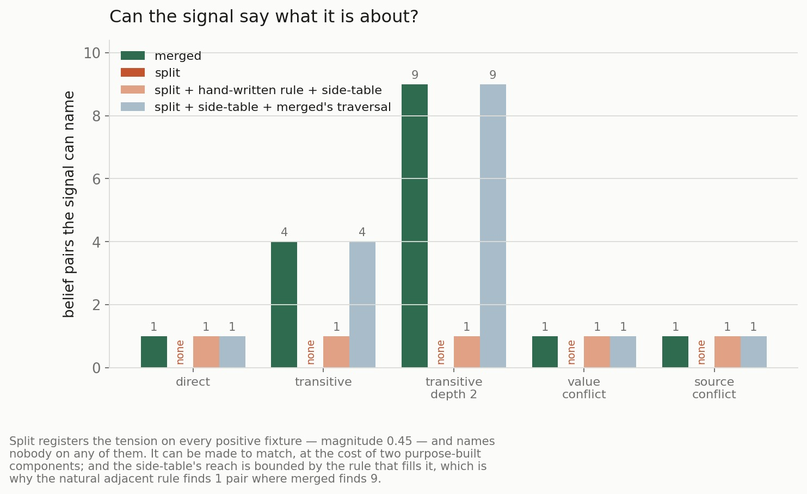
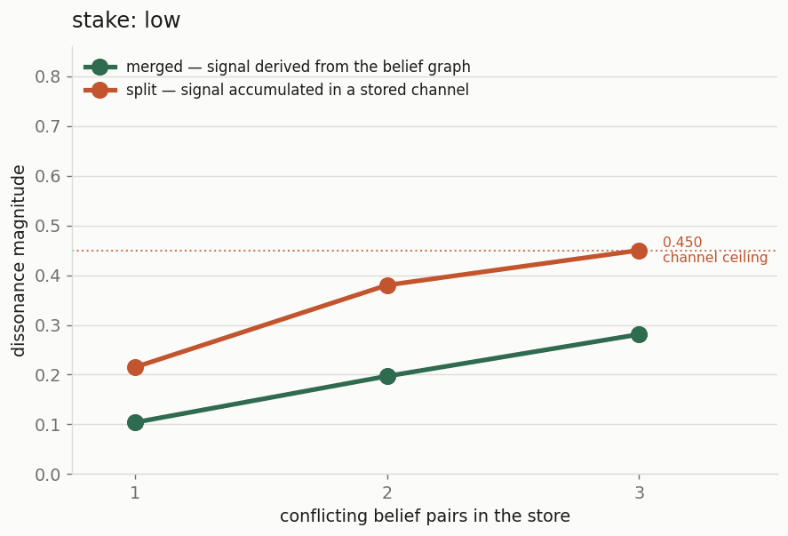
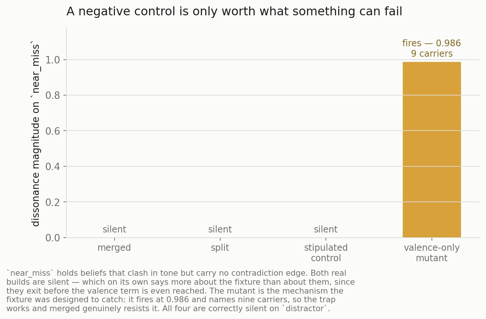
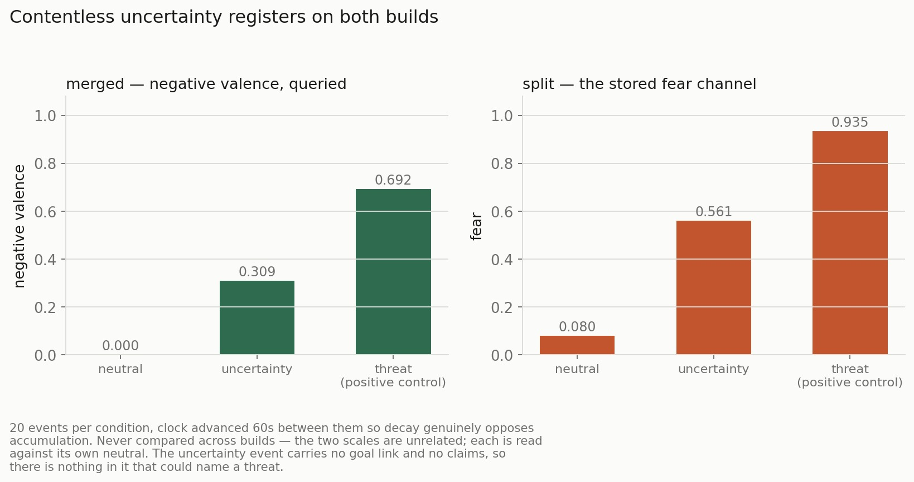
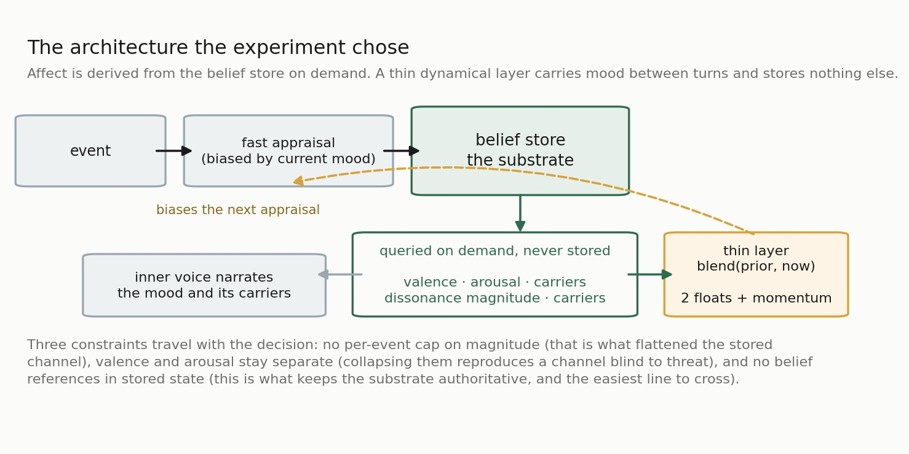

# Does Affect Need State of Its Own?

**Experiment 2 of the Manyu programme — the merge/split architecture fork.**
Two builds from one codebase · decision rules fixed before any code was written ·
every number below from a deterministic offline run.

Source documents: [requirements](../experiments/02-merge-split-fork/requirements.md) ·
[design](../experiments/02-merge-split-fork/design.md) ·
[methodology](../experiments/02-merge-split-fork/methodology.md) ·
[results](../experiments/02-merge-split-fork/results.md) ·
[the decision it produced](../adr-002-merged-substrate.md)

---

## The question

Manyu's beliefs already carry a valence. A belief is not just *the deploy
failed* — it is *the deploy failed*, weighted, with a stake attached and
evidence behind it. Given that, the architecture faces a genuine fork:

> Does stored, decaying affect state still need to exist?

One answer says yes. Affect is a dynamical system in its own right — it
accumulates, decays on a half-life, carries momentum across turns, and does
things a static graph cannot. That is the current build: an `AffectState` with
eight emotion channels and a `MoodState` with inertia.

The other says no. An emotion just *is* a belief with a valence and a stake, so
affect should be **derived from the belief store on demand** — recomputed at read
time from valence, evidence salience, and the graph's `contradicts` and
`supports` edges. Nothing stored, nothing to decay.

This is not an idle question. Everything built after this point sits on the
winner. And the prior going in was hybrid — keep a little stored state, derive
the rest — which is exactly the prior most likely to confirm itself if the test
is loose.

---

## What makes a fork like this decidable

Architecture arguments in this area are usually settled one of two ways: by
appeal to design taste, or by benchmarking two systems on a task and declaring
the winner. Both have a known weakness. Design arguments cannot lose. Task
benchmarks conflate the architecture with everything else that differs between
two implementations.

Three commitments made this one decidable instead.

**Both builds ship from one tree, behind a flag.** `manyu-merged` is mostly a
deletion plus a query, not a rewrite; both expose the identical read interface,
so a harness runs unchanged against either. A forked branch would drift, and
every comparison would become arguable.

**The decision rules were written before the code.** Not the predictions — the
*rules*: what result counts as a win for each build, what counts as no verdict,
and what happens in each cell of the joint outcome table. Two of the four cells
falsify the hybrid prior. They are the reason to run it.

**The controls were built to defeat the author's own prior.** Two in particular:

- a **stipulated** build, to check the test can be failed at all;
- a **steelman** of the disfavoured build — split handed the favoured build's
  machinery — to check the test is not rigged toward the favourite.

And the discriminating question is not *which performs better*. It is **what can
each representation express?** That turns out to be answerable in the type
system rather than in the results table, which is a much stronger place for an
answer to live.

---

## Finding 1: a stored number cannot say what it is about

Start with the thing an affect signal is supposed to be *for*. A dissonance
signal that says *0.45* is nearly useless. A signal that says *0.45, and it is
these two commitments pulling against each other* is a control signal you can
act on.

`AffectState.emotions` is a `dict[str, float]`. **A scalar has no pointers back
into the graph.** Merged's affect is already a query over the belief store, so
it recomputes the carriers on demand and nothing has to be remembered. Split's
affect is an accumulated number; for that number to say what it is about,
something must have written the sources down separately.

That asymmetry is not an implementation choice. It is enforced in the types:
split's detector takes an `AppraisalView` — an agent id, a level, a baseline —
and never receives the store at all.

Split registers the tension on every positive fixture, at magnitude 0.45, and
**names nobody on any of them.**

The interesting half is what it costs to close that gap, because split *can* be
made to match. It needs two components the architecture does not provide: a
hand-written `BeliefConflictRule` to bridge from the affect layer to the graph,
and a `SourceTable` — a side-store holding the belief ids the scalar cannot,
maintained alongside the affect state.

And the table's reach is bounded by the rule that fills it. With the natural
adjacent-pair rule, split names the stated pair and stays blind to all eight
derived ones on the depth-2 fixture: one carrier where merged finds nine.
Reaching merged's coverage requires a traversing rule — which is merged's query,
called from inside split.

**So the finding is a cost, not a capability.** Naming the sources of a
dissonance signal is free for merged and takes two purpose-built components for
split, one of which is a copy of the thing it was competing against.

*How to falsify it:* write a split build that names sources without a
side-table. If the affect layer can carry belief references without becoming a
query over beliefs, this is wrong.

*What it does not cover:* two of the five fixtures — value conflict and source
conflict — are the direct case with different metadata, which both mechanisms
ignore by design. They are sanity checks and carry no weight in the finding.

---

## Finding 2: a stored channel saturates

The second question is whether the signal is *readable* — whether it grades.

The ladder is built by construction: zero, one, two or three conflicting pairs,
crossed with low, medium and high stake. The ordering is known before anything
runs, so the only question is whether each build reproduces it.

Both builds are monotone in both axes. They are not equally readable.

|  | merged | split |
|---|---|---|
| distinct values across 12 cells | **10** | 5 |
| range | 0.000 – 0.776 | 0.05 – 0.450 |
| cells pinned at the maximum | none | **7 of 12** |

0.450 is `baseline (0.05) + max_delta_per_event (0.40)`. Split's affect channels
are bounded per event — that bounding is precisely what makes them stable, and
it is a virtue in every other context — and a dissonance signal routed through
one inherits the bound and flattens above it.

**This does not depend on the constant.** Every channel in the default profile
caps between 0.25 and 0.35, so the 0.40 used here is already more generous than
any of them. A single high-stake conflicting pair produces roughly 0.75 of raw
tension. Split saturates at one pair under any profile-consistent bound.

The consequence is concrete rather than aesthetic. The next experiment in the
programme modulates arbitration thresholds with this signal — *how much
discomfort does it take before the agent reopens a decision?* A signal that
reads 0.45 whether there is one contradiction or three cannot do that. It is a
boolean wearing a float's clothing.

---

## The two findings are one property seen twice

Worth stating plainly, because it is the kind of thing that quietly doubles the
apparent evidence.

Source-naming and gradedness are both consequences of the same fact — **split's
affect is a stored number** — seen from two angles. A stored scalar has no
pointers, so it cannot name; and a stored channel has a per-event bound, so it
cannot grade. That is one finding counted twice, and the decision was weighted
accordingly.

---

## What merged loses

The counterweight, recorded so it does not get lost in the result.

Split's single `fear` channel does two jobs at once: it says *something is
wrong* and *how strongly*. Merged needs two numbers for that, because its
arousal is deliberately blind to valence.

Measured across three conditions — calm, uncertain, and threatening — merged's
arousal moves from 0.678 to 0.738. A range of 0.06, essentially flat. That is
not a defect: merged's arousal is `1 − exp(−Σstake/τ)`, and neither stake nor τ
depends on valence, so it measures *how much is on the agent's mind*, not how
bad any of it is. It is the standard circumplex separation, and it is correct.

But it means **a store of pleasant beliefs is exactly as aroused as a store of
dreadful ones**, and any read of merged's affective situation needs valence
alongside arousal. Split got that for free from one channel. Merged pays two
numbers for it.

---

## A negative control is only worth what something can fail

One piece of apparatus is load-bearing for the specificity claim, so it belongs
in the article rather than the appendix.

Both real builds are silent on both negative fixtures. On its own that
establishes very little — they return early on `near_miss` *before* the valence
term is ever reached, because the fixture holds no contradiction edges. Their
silence was evidence about the fixture, not about them.

So the fixture was tested against a mutant: a valence-only variant that mistakes
merged's `(1 + |Δv|)/2` weighting term for a *detector*. That is exactly the
implementation mistake `near_miss` was designed to catch — a build that would
fire on every line of that fixture while still scoring full marks on everything
else.

It fires at 0.986 with nine carriers, and is correctly silent on the other
negative. The trap works, and merged genuinely resists it.

Without the mutant, "both builds are silent" is a sentence about an
unfalsifiable test. With it, it is a result.

---

## The other discriminator: affect without an object

The second question the fork was meant to settle is whether affect arises from
*contentless* uncertainty — a system that becomes anxious with nothing in
particular to be anxious about.

Twenty events per condition, with the clock advancing sixty seconds between them
so that decay genuinely opposes accumulation. Both builds order the conditions
correctly, and the numbers are never compared across builds — the two scales are
unrelated, so each is read against its own neutral.

The revealing detail is in *how* split gets there. The uncertainty event carries
no goal link and no claims: there is nothing in it that could name a threat. It
still produces fear, because the appraiser groups tool results with goal
obstructions and defaults to a negative reading when goal impact is
non-negative.

**Split's route to object-less affect is an accident of a rule table.** It is
used as-is here, and pinned by a test whose docstring says that changing it
invalidates the result rather than merely breaking a test. But it is the same
shape as finding 1: where merged reads a structure, split consults a table
somebody wrote.

This discriminator did not decide the fork. The decision rests on the two
findings above.

---

## The decision

Affect is **derived from the belief store on demand**. What the system feels,
and what it feels it *about*, are recomputed at read time. A **thin dynamical
layer** sits on top holding a blended valence and arousal so that mood carries
between turns — and it stores no belief references and no discrete emotions.

The largest structural consequence is easy to miss: **the inner voice moves from
upstream of mood to downstream of it.** Mood used to be whatever the inner-voice
composer's influence vector said it was — prompt-shaped, carrying no belief
references. It is now a fact about the belief store, and the language model
consumes it rather than producing it.

Three constraints travel with the decision, each one a direct read from a
result:

1. **No per-event hard cap on magnitude.** That is what flattened the stored
   channel. Saturation may only come from a constant chosen to leave range
   across the operating region.
2. **Valence and arousal stay separate.** Collapsing them reproduces a channel
   that cannot tell calm from threatened.
3. **No belief references in stored state.** This is what keeps the substrate
   authoritative, and it is the easiest line to cross for a plausible reason.

---

## What the decision rests on, and what it doesn't

**It rests on** two offline, deterministic findings — source-naming cost and
gradedness — which are one property seen twice, and which favour merged.

**It does not rest on the dynamics.** Lingering mood and revision lag were not
among the discriminators run. The thin layer is adopted **on design grounds, not
on evidence**: merged alone demonstrably has no inertia, and inertia is what the
split architecture was keeping. That is the honest status of half the decision.

**The boundary is a modelling choice.** Putting the store behind a bridge rule
and the scalar in front of it is the fair reading of how the appraiser and the
affect state are actually built — but nothing in the codebase *forces* that
line. A reader who thinks split's affect layer should have belief access will
reject finding 1, and the argument they need to make is about the boundary, not
about the numbers.

**The eight discrete emotion channels are retained, unchanged and untested.**
Whether those should also become queries is a coherent extension neither
discriminator examined. Keeping them is the conservative option, not the
reasoned one.

---

*Previously in this series: [experiment 1, introspective honesty](01-introspective-honesty.md)
— the scorer this experiment consumed, and the methodological rules it turned
into coded gates.*
