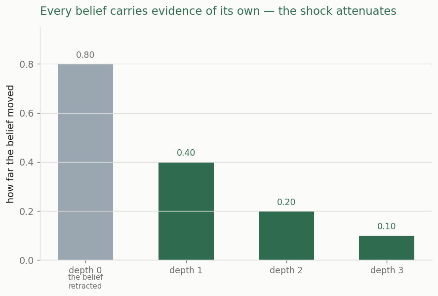
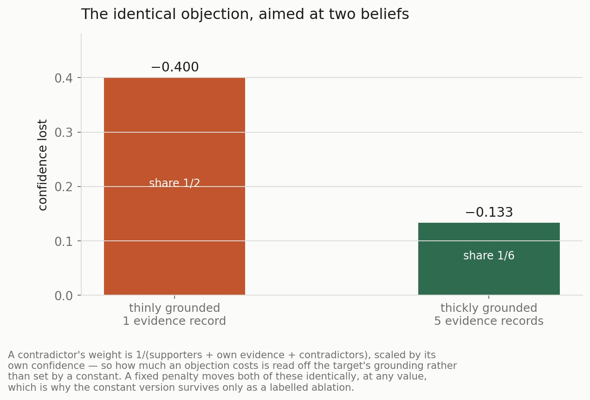
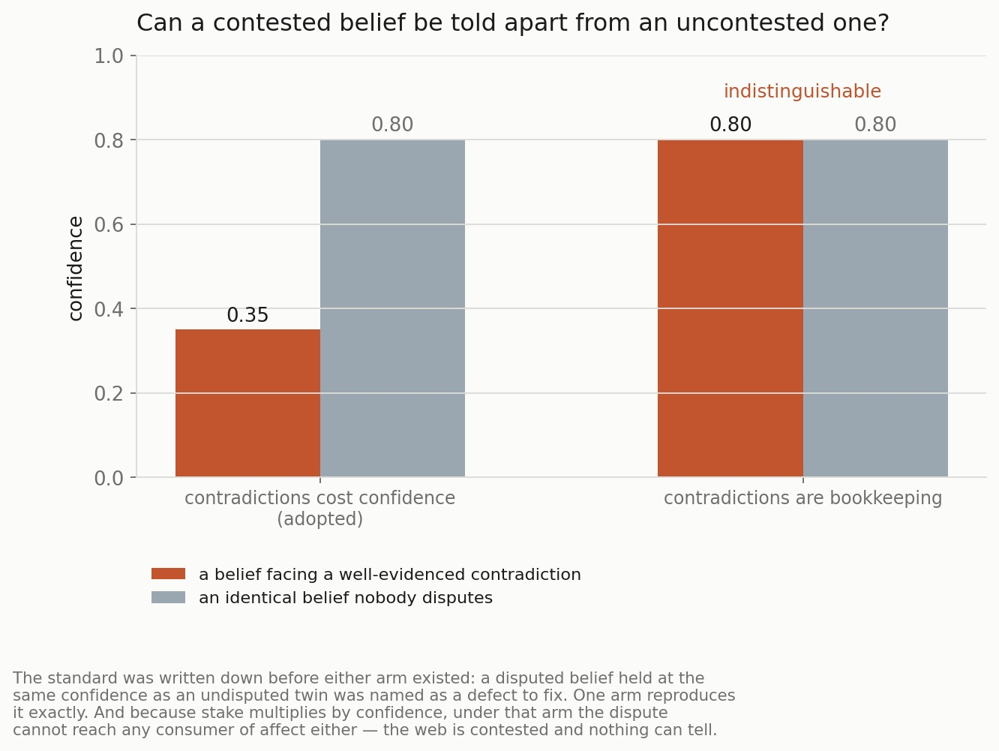
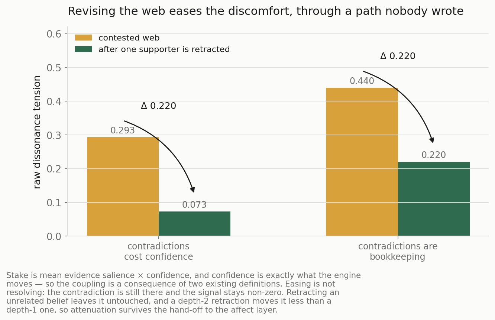
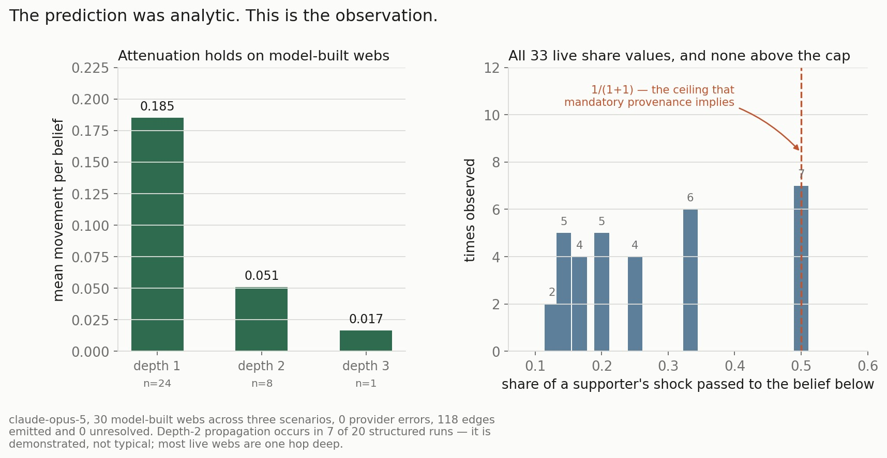

# When You Retract a Belief, What Falls With It?

**Experiment 3 of the Manyu programme — foundationalism vs. the Quinean web.**
Engine offline and deterministic · live confirmation on `claude-opus-5`, 30
model-built webs, 0 provider errors.

Source documents: [requirements](../experiments/03-foundationalism-quinean-web/requirements.md) ·
[methodology](../experiments/03-foundationalism-quinean-web/methodology.md) ·
[results](../experiments/03-foundationalism-quinean-web/results.md) ·
[retrospective](../experiments/03-foundationalism-quinean-web/retrospective.md) ·
[extractor feasibility](../experiments/03-foundationalism-quinean-web/stage0-extractor-feasibility.md)

---

## The question

Epistemology has an old argument about the shape of knowledge. The
foundationalist picture says beliefs rest on other beliefs, in chains that
bottom out somewhere: pull out a support and everything above it falls. The
coherentist picture — Quine's web — says beliefs hold each other up in a mesh:
pull one out and the web sags, adjusts, redistributes, and carries on.

The argument has run for sixty years, largely because it is hard to see what
observation would settle it. Both pictures are consistent with how people
actually revise their views, and introspection is not evidence.

Manyu makes a narrower version of it mechanical. Its beliefs carry provenance —
evidence records, `supports` edges, `contradicts` edges — so you can retract a
supported belief and watch precisely what moves, how far, and how far out.

The result is not a verdict for either side. It is something more useful, and
the article is organised around getting to it honestly.

---

## What is usually missing

Three bodies of work already do parts of this, and the gaps are instructive.

**Philosophical argument** proceeds by regress arguments and intuition pumps.
It is careful and it is unresolvable by observation, because there is no system
whose grounding you can read off directly.

**Truth-maintenance systems** — the justification-tracking machinery from
classic AI — do exactly the mechanical thing: they record why each belief is
held and retract dependents when a justification goes away. But a belief with no
remaining valid justification goes *out*. Collapse is built in. The system is
foundationalist because it was designed that way, not because anything was
discovered.

**Formal belief revision** (the AGM tradition) gives postulates constraining
what a rational revision may do, but the ordering that decides what survives a
contraction is supplied from outside the formalism. It tells you what is
consistent, not what a particular system will do.

The common shape: **the epistemology is chosen by the designer and then obeyed.**
It is a premise, not an observable.

Manyu's difference is that the epistemology is a **readable property of the
substrate** — and there is a switch that makes the other regime appear. That is
what turns the dispute into something you can put a number on.

---

## Finding 1: it ripples — and the ablation is what makes that worth saying

Retract a belief holding confidence 0.8 at the head of a support chain, and the
shock attenuates as it travels: 0.400 at the first hop, 0.200 at the second,
0.100 at the third. Non-zero at depth 3, so the ripple reaches; strictly
decreasing, so it decays; and the total that moves downstream stays below the
shock that started it, without anything being pinned to make that true.

That is a Quinean-looking picture, and reporting it as one would be wrong.

Manyu's belief core refuses any candidate that arrives without evidence of its
own. Every belief therefore has independent grounding, no belief rests
*entirely* on another, and **full foundationalist collapse is not
representable.** A graded ripple is not evidence for the web over the
foundation; the alternative was never on the table.

So the experiment does the one thing that makes the observation mean something:
it lifts that rule and runs the same engine on the same fixture.

Collapse appears immediately, and undiminished all the way down the chain.

That reframes the finding into something sharper than picking a side:

> **Whether a belief collapses or sags is settled by how it is grounded.** A
> belief holding evidence of its own bends; one resting purely on another falls
> with it. The substrate decides which case you are in.

This is a better result than *Quine wins*, and a more modest one. It converts an
unfalsifiable dispute into a structural property you can read off a store — and
it says the epistemology follows from the provenance requirement, not from any
propagation rule the engine happens to implement.

---

## Finding 2: the propagation has no free constants

The first build of the engine had an attenuation constant of 0.6. It was
removed, and the reason is the whole methodological point of this stage.

**In a chain, every node has exactly one supporter — so the constant is the only
source of decay.** A result produced that way is not a finding about belief
structure; the constant *is* the hypothesis, wearing a parameter's clothes.

What replaced it is read off the store. The share of a shock that a belief
passes on is `1 / (supporters + its own evidence)`. Nothing is chosen. And the
propagation results are byte-identical whether the old constant is set to 0.1,
0.6 or 1.0 — because it is never consulted.

Three properties follow, none of them tuned:

- **A net absorbs what a chain transmits.** A belief with three supporters moves
  0.200 where the same belief with one supporter moves 0.400.
- **Own evidence shields.** A belief corroborated five times moves less than one
  corroborated once, from the identical retraction.
- **Contradiction is priced the same way**, from
  `1 / (supporters + own evidence + contradictors)`, scaled by the
  contradictor's own confidence.

That last one produces the cleanest single illustration of what "derived rather
than chosen" buys:

The same objection costs a thinly grounded belief 0.400 and a thickly grounded
one 0.133. **A fixed penalty cannot represent that difference at any value** —
which is the property that decided it, and the constant version now survives
only as a labelled ablation that fails the test on purpose.

There is a second design consequence hidden in the denominator. Every
contradictor sits in it, so a second objection *dilutes* the first rather than
stacking on top of it. Otherwise enough objections would flatten any belief
regardless of how well it was grounded — which is a vote, not an epistemology.

And the mechanism keys on the declared graph rather than on resemblance. A
negative fixture holding beliefs on the same topic, in near-identical wording,
with matching valence, and no edges between them, produces **zero movement.** A
rule keying on similarity would pass every positive case above and fail exactly
there.

---

## Finding 3: a contested belief has to be representable

Before any of the mechanism existed, one defect was named in writing: *a
contested belief held at 0.9*. If the web can be in dispute and nothing in the
numbers shows it, the dispute is decorative.

Two designs were built for what a contradiction does. In one it is priced — a
contradiction costs confidence, and weakening the contradictor refunds exactly
the fraction of the penalty it no longer justifies. In the other it is
bookkeeping — the edge is recorded and nothing is charged.

The bookkeeping design leaves a disputed belief numerically identical to an
undisputed twin. It reproduces the exact defect the experiment was chartered to
fix — and because stake multiplies by confidence, the dispute cannot reach any
consumer of affect either. The web is contested and nothing downstream can tell.

Worth being precise about what decided this: **the pricing design was adopted on
its rival's failure, not on its own success.** No particular penalty was shown
to be correct. What was shown is that one option fails a standard written down
before either option existed. That is a weaker claim than it looks like from the
chart, and it is the accurate one.

The other standard was **round-trip coherence**: assert a contradiction, retract
the contradictor, and the web must return to where it started — otherwise
retracting a false accusation never restores the accused belief. Both designs
satisfy it, including under partial retraction.

---

## Finding 4: discomfort is coupled to revision through a path nobody wrote

Manyu computes a dissonance signal over its belief store. The question this
stage asks is whether that signal is *dynamically coupled* to revision — whether
fixing the web actually eases the discomfort.

It is, and by an accident of two existing definitions rather than a designed
connection. Stake is `mean(evidence salience) × confidence`. Confidence is
exactly what the revision engine moves. So a retraction reaches the affect layer
through a pathway that was never authored as one.

Retracting a supporter of a contested belief reduces the tension and does not
zero it — the contradiction is still there, so easing is not resolving.
Retracting an *unrelated* belief leaves the signal untouched, which is the
control that matters: without it, any mechanism recomputing a global number
would pass. A depth-2 retraction moves the signal less than a depth-1 one, so
attenuation survives the hand-off. And the belief valences are byte-identical
before and after, so nothing here is reading an authored number back to itself.

**Claimed narrowly:** the contradiction is still a declared edge and the
valences are still authored. This is not *dissonance arose spontaneously*. It is
that dissonance moves when the web moves — the precondition the next experiment
needs before it can ask whether the signal *controls* anything.

One warning came out of it that the next experiment has to carry. The raw
tension drop is *identical* under both contradiction designs, because tension
reads the weaker party of a conflicting pair and the propagation delta never
touches the contested belief's starting confidence. The saturated magnitude
differs — but only because the magnitude curve is concave, so the same raw drop
taken from a lower baseline sits on a steeper part of it. **A magnitude delta
confounds how much tension changed with where on the curve the web was
sitting.** Read as a measure of belief dynamics it will credit the mechanism for
what is really curve position.

---

## Finding 5: it fires on webs a model actually builds

Everything above runs on hand-authored fixtures. The last stage asks whether any
of it describes a regime that occurs — whether webs extracted from ordinary
conversational material carry structure a retraction can traverse at all.

Three scenarios, ten runs each, on `claude-opus-5`. Seven predictions, five of
them registered before the numbers were visible. All seven pass, including the
one that mattered: **depth-2 propagation is reached on both structured
scenarios.**

Attenuation holds on model-built webs — mean movement 0.185 at the first hop and
0.051 at the second. And the right-hand panel is the part worth pausing on.

The cap on how much of a shock one belief can pass to another was derived
analytically from the mandatory-provenance rule: since every belief carries at
least one evidence record of its own, the share can never exceed `1/(1+1)`.
Across all 33 share values observed on live, model-built webs, the maximum is
**exactly 0.5**, and nothing exceeds it. The foreclosure stops being an argument
about the substrate and becomes a measurement of it.

**The honest reading**, because the chart flatters it slightly: depth-2
propagation *occurs* but is not typical — 7 of 20 structured runs. Most live
webs are one hop deep. What is established is that the mechanism fires on real
input, not that deep webs are the common case. Anything built on this engine
should expect one-hop webs as the default and treat deeper structure as
something to elicit.

---

## What the conclusions rest on

- **The foundationalist limb is only reachable by ablation.** That is the
  finding, not a caveat — but it means this experiment compares a substrate
  against a switched-off version of itself, not two architectures in the wild.
- **One model, one provider.** As in the two experiments before it. And a
  specificity result established on one provider is provisional: the extractor's
  behaviour on the negative control differed markedly between two of them.
- **Entailment quality was never graded.** The edges a model emits are
  structurally plausible and correctly directed, and every one is dumped
  alongside both propositions so the judgement is re-checkable. Nobody scored
  whether each is a genuine entailment.

---

*Previously in this series: [experiment 1, introspective honesty](01-introspective-honesty.md)
and [experiment 2, the merge/split fork](02-merge-split-fork.md) — which chose
the substrate this revision engine is built on.*
