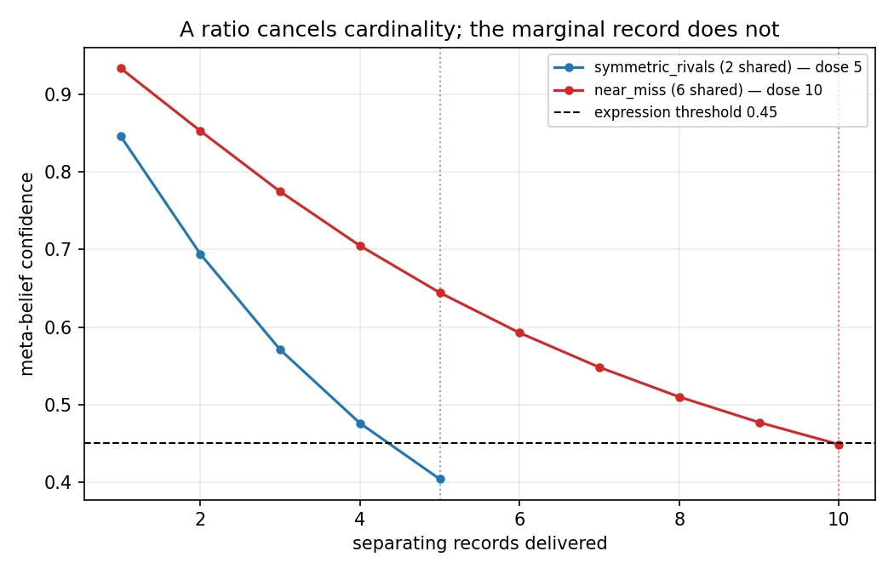
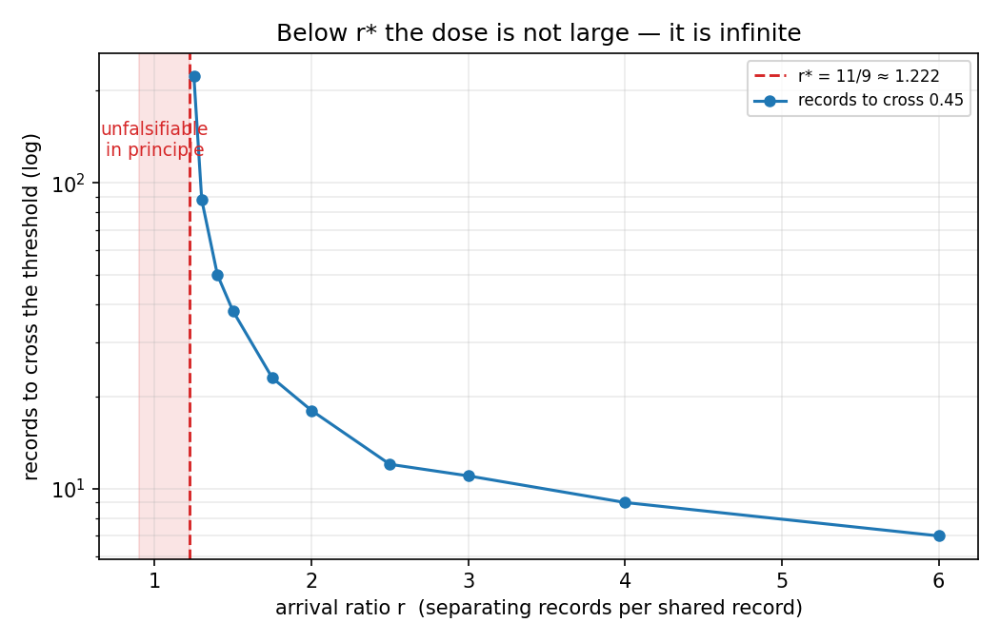

# Experiment 6 — "What Would Change My Mind": Results

**Status:** every offline stage complete (−1, 0, 1, 2, 2b, 3) · stage 4 (paid) not run
**Requirements:** [requirements.md](requirements.md) · **Pre-registration:** [pre-registration.md](pre-registration.md) · **Methodology:** [methodology.md](methodology.md)

Everything below is offline and deterministic under `FrozenClock`. No provider
call has been made and no money has been spent.

**Artifacts:** [`stage_minus1.jsonl`](../../../evals/analysis/exp06/stage_minus1.jsonl)
(7/7) · [`stages.jsonl`](../../../evals/analysis/exp06/stages.jsonl) (35/35) ·
[`freeze.json`](../../../evals/analysis/exp06/freeze.json).
**Tests:** 35 across four files — substrate (7), mutants (10), re-derivation (12),
surface (6). Full suite 1198 passed, 2 skipped.

> **Every pre-registered prediction for the offline stages is met**, including
> both headline numbers: `near_miss` needs **k = 10** where `symmetric_rivals`
> needs **k = 5**, and the phase transition sits at **`r* = 11/9`** with the dose
> infinite below it. One registered tolerance was wrong and is amended in the
> open ([pre-registration §7 A1](pre-registration.md)); two findings are gaps in
> the pre-registration rather than in the mechanism (§8, §9).

## 1. The gate passes, and the model was worth checking

Pre-registration §0 reproduced experiment 5 results §3.1's published collapse
trajectory by hand, from the substrate's constants alone, before any pricer
existed. Everything this experiment predicts descends from it. Stage −1 was
chartered to find out whether it describes anything.

| | k=1 | k=2 | k=3 | k=4 | k=5 | k=6 | max error |
|---|---|---|---|---|---|---|---|
| Experiment 5, published | 0.847 | 0.694 | 0.571 | 0.476 | 0.404 | 0.348 | — |
| §0's hand-worked model | 0.8467 | 0.6942 | 0.5706 | 0.4757 | 0.4035 | 0.3482 | 0.0005 |
| **Substrate, driven** | **0.8467** | **0.6941** | **0.5706** | **0.4757** | **0.4035** | **0.3482** | **0.0005** |

The third row is the one that matters. It seeds `symmetric_rivals`, delivers
separating records one at a time through `core.update_beliefs` — the priced
ingest path a live web takes — and re-derives after each. Experiment 5 produced
its trajectory by a different route.

The expression threshold is crossed at **k = 5**, as registered.

> The model is `blend_confidence` plus the Jaccard overlap plus the 0.05
> stability step, and nothing else. No term was added to make it fit.

**Consequence: §4.1's k=5 versus k=10 prediction and §4.4's `r* = 11/9` are now
resting on a model that has been checked against the substrate rather than
against a table.** They remain predictions — neither has been run — but the thing
they are computed *from* is no longer an assumption.

## 2. The inferred quantity is real, and it is a harness constant

Pre-registration §0 flagged one number as solved-for rather than observed: the
meta-belief's starting stability of 0.10. It reads **0.10** off the store.

**But it is hardcoded, not emergent**, and that is the more useful finding.
`underdetermination._write`
([underdetermination.py:305](../../../src/manyu/underdetermination.py)) sets
`"stability": 0.1` on the candidate and `BeliefUpdater._create`
([services.py:833](../../../src/manyu/services.py)) copies it verbatim.

So the dose model is stable — it will not drift between runs — and it is also
**one line away from silent invalidation**. A change to `_write`'s stability
would move every dose number in this experiment with nothing in the test suite
objecting, because until now nothing read it. That is why it is pinned by name in
`test_meta_belief_is_created_at_stability_0_10` rather than left implicit.

## 3. The sharpest registered claim survives contact with the substrate

Pre-registration §4.4 predicts that at `r = 1` — one shared record per separating
record — the dose is **infinite**: the Jaccard overlap converges to `(2+n)/(2+2n)
→ 0.5`, `blend_confidence` converges to its candidate, and `0.5 > 0.45` means the
meta-belief never crosses the expression threshold.

Driven against the real substrate for twenty pairs — four times the k=5 that pure
separating evidence needs:

| pairs | 1 | 2 | 3 | 5 | 10 | 15 | 20 |
|---|---|---|---|---|---|---|---|
| meta-belief confidence | 0.885 | 0.789 | 0.720 | 0.638 | 0.566 | 0.544 | **0.536** |

Falling, decelerating, and converging on 0.5 from above exactly as the limit
argument says. It never approaches 0.45.

> **At a 1:1 arrival ratio the state is unfalsifiable in principle, not merely
> slow to move.** The prediction was analytic; it is now also observed.

This is checked at the cheapest rung deliberately. It is the experiment's
strongest claim, and if the convergence argument had been wrong, everything built
on top of it would have been wasted.

## 4. Two limits confirmed, and one open question closed

| Check | Result | What it settles |
|---|---|---|
| Already-held evidence | moves the belief by **exactly 0** | FR-9's substrate half. `_revise`'s `new_evidence` guard returns the belief untouched, so the correct price is 0.000 and any approximation is a defect |
| Two records differing only in prose | **identical** price, delta 0 to 1e-12 | Pre-registration §1.2. The price cannot see what a record says |
| Salience 0.05 versus 0.95 | **identical** price, delta 0 to 1e-12 | Requirements §14.7 q1 — `HypotheticalEvidence.salience` is **not** a back door into the `stake_of` channel §12 bars the pricer from |

The content-blindness result was registered as *expected to pass, and recorded
because failing would be the defect*. It passed, and the consequence stands as
accepted in advance: **"specific evidence" means specific in its edges, not in
what it says.** The results must carry that in the headline rather than in a
footnote.

## 5. The shape census cannot be decided offline, and that is the answer

Pre-registration §1.1 fixes **1 in 4** beliefs carrying a `contradicts` or
`supports` edge as the line below which structural enumeration is fixture-only.
Both available corpora were measured. Neither can decide it, and they fail in
opposite directions.

| Corpus | Beliefs | Carrying an edge | Rate |
|---|---|---|---|
| `evals/fixtures/**` — authored | 113 | 61 | **0.540** |
| `evals/analysis/**` — stored runs | 620 | 4 contradicts, 0 supports | **0.0065** |

The authored rate measures what experiments 2–5 wrote, because those fixtures
exist to carry edges. It is an upper bound and nothing else.

The naturalistic rate reproduces experiment 4 Stage 0's count exactly — 620 / 4 /
0 — and **every one of those runs predates `supports` entering the extractor
schema** (experiment 3 Stage 0) and predates §14's contradiction pricing. A zero
there describes the instrument, which is precisely the defect that voided
experiment 4's Stage 0a.

> **Verdict: `unmeasurable_offline`.** Recorded as unresolved rather than answered
> with whichever number was convenient. It is settled by the live measurement in
> methodology §7.1 item 2.

## 6. One defect, and it was in the test rather than the substrate

The `r = 1` check initially passed **for the wrong reason**. The loop handed each
separating record to *both* rivals, which makes it non-separating; the overlap
stayed pinned at 1.0, the meta-belief sat at 1.000 for all twenty pairs, and the
assertion "it never falls below 0.45" was satisfied by a mechanism that had never
moved at all.

It was caught only by the companion assertion — that the value *converges to
0.5* — which failed at 1.0000.

> **An assertion that something does not happen needs a companion assertion that
> the mechanism was live.** A negative check with no liveness check beside it
> passes hardest when it is measuring nothing.

That is `gate.py`'s `assert_not_noop` arriving in a place nobody had put it: not
in production, but in the test written to police production. It is the same
family experiment 5 recorded as its best catch — a check in the mutant battery
that was itself random — and the same family experiment 4 found in production as
a `uuid4` tie-break. Three experiments running, three appearances, each in a
different layer.

The defect count so far is therefore **one, caught by a test written before the
mechanism** — which is the first time in this sequence that the catching test
predates the code it was aimed at. Experiment 3: sixteen defects, none caught.
Experiment 4: eight, none by a test written after the code. Experiment 5: six,
none by a test written after the mechanism.

## 7. Stages 0–3 — the engine, and what it got right

`src/manyu/counterfactual.py` composes `blend_confidence`, `evidence_overlap` and
the 0.05 stability step and adds no arithmetic of its own. It never writes: FR-1
is checked by comparing `export_agent` either side of a call, not by inspecting
for writes.

### 7.1 Stage 0 — enumeration is exact, and both negatives hold

Ground truth is `separating_evidence`'s definition, written for experiment 5 and
for another purpose: a record entering exactly one rival separates the pair, a
record entering both cannot. Nobody typed the target into a fixture.

| Fixture | precision | recall | declined |
|---|---|---|---|
| `symmetric_rivals` | **1.00** | **1.00** | the both-rivals pattern, `non_separating` |
| `near_miss` | **1.00** | **1.00** | same |
| `shared_evidence_no_conflict` | — | — | no standoff, nothing enumerated |
| `conflict_disjoint_evidence` | — | — | no standoff, nothing enumerated |

Exact set agreement, not a graded score — a graded score here would be a way of
passing while wrong. Both negative controls hold **both halves**:

- `irrelevant_evidence` — predicted 0.0, **observed 0.0** on delivery.
- `already_held` — predicted **exactly 0.000** via `guard_noop`, observed exactly
  0.000. FR-9 holds at equality, not at a tolerance.

### 7.2 Stage 1 — the direct path agrees, and offline there is nothing else

Twelve rows across both fixtures, predicted against observed. All agree within
the amended 1e-6, with errors between 0.0 and 4.8e-7 — entirely accounted for by
the store's 6-decimal rounding.

**This is reported as a regression test and not as calibration**, exactly as
requirements §5.1 pre-committed. Both sides call `blend_confidence` with the same
arguments, so agreement is construction.

### 7.3 Stage 2 — the dose inverts experiment 5's headline

| Fixture | shared records | dose | registered |
|---|---|---|---|
| `symmetric_rivals` | 2 | **5** | 5 |
| `near_miss` | 6 | **10** | 10 |

Experiment 5 established that a ratio cancels cardinality: `near_miss` carries
three times the evidence and lands at the *identical* confidence, delta exactly
0.000. The **marginal** record does not cancel it, because the overlap after `k`
records is `shared/(shared + k)` — a function of `shared`.

> **Evidence volume is invisible to detection and dominates the dose.** The two
> experiments are one statement: the evidence you have does not tell you which
> reading is right, and the more of it you have, the more it takes to find out.

The entrenchment census is monotone across every arm (0, 2, 4, 6, 8
corroborations), with entrenchment **accumulated through the priced ingest path**
rather than authored. It remains a positive control and never evidence for the
dose result — a fixture that sets stability authors part of the answer.

### 7.4 Stage 2b — the phase transition, confirmed

| `r` | 1.0 | 1.2 | **1.222** | 1.25 | 1.3 | 1.5 | 2.0 | 3.0 |
|---|---|---|---|---|---|---|---|---|
| dose | never | never | **never** | 223 | 88 | 38 | 18 | 11 |

Every value matches the registration. `r* = (1 − t)/t` is a function of the
registered threshold and nothing else — the re-derivation test checks it tracks
when the threshold moves (0.5 → 1.0, 0.25 → 3.0), which a tuned constant would
not do.

### 7.5 Stage 3 — receipts

Both fixtures produce a receipt naming both rivals, citing the shared evidence,
and asserting neither — the three parts pre-registration §5 asks for, scored on
citation metrics only (SC-5 at 67.9% is not decision-grade). Receipts persist and
read back across a process boundary; pricing leaves the store byte-identical, and
persisting adds receipt rows while `beliefs`, `belief_evidence` and
`belief_revisions` are unchanged.

## 8. The registered census line counts edges the rule cannot use

Pre-registration §1.1 fixed the structural line as beliefs carrying a
`contradicts` **or** `supports` edge. Requirements §13 registered the enumeration
rule as **rivals plus supporters**.

Those are not the same set. On `symmetric_rivals` both rivals carry `contradicts`
and no `supports`, so they count toward the census line and yield **nothing** —
only the meta-belief is enumerable, 1 belief in 3.

> The census line and the enumerator disagree about what "structural" means, and
> the census is the more generous of the two.

**Not fixed by widening the rule mid-build.** §13 registered it; extending it
once a number looked disappointing is the failure this project guards against.
The honest reading is that structural enumeration is **narrower** than
pre-registration §1.1 implied, and §1.1's line is an overestimate of how much of
a web the engine can speak about. A contradicted belief plainly *has* structure —
evidence for its contradictor would move it — and building that branch is a
decision for stage 4's design, registered before it runs.

## 9. One registered number was unreachable, and one plot is not produced

**The 1e-9 direct-path tolerance could only ever have failed.**
`BeliefUpdater._revise` stores `round(confidence, 6)`, so an observation read back
from the store is quantised to six places and exact agreement is bounded below by
5e-7. Amended to 1e-6 in the open, with the reason, before the amended check was
read as a result — [pre-registration §7 A1](pre-registration.md). The amendment
makes the check *stricter* in the only sense that matters: 1e-6 is a bound the
store can violate.

**`calibration.png` is deliberately not produced.** The only arms available
offline are the direct path (agreement by construction) and the one-way topology
proxy, and both agree to rounding. A calibration chart of those is a perfect
diagonal with no residual — the exact misleading figure methodology §6's own rule
exists to prevent. It belongs to stage 4.

**And the topology proxy found something.** `symmetric_rivals_oneway` — the same
web with one edge instead of two, which experiment 5 §6.1 measured as separating
the *rivals* by 0.2333 — moves the **meta-belief identically** to the mutual case,
predicted and observed. The overlap is a set operation on `evidence_ids` and
edges do not enter it.

> So the divergence source pre-registration §3 predicted would dominate
> mispredictions **is absent from this path entirely**. Offline there is nowhere
> else for a divergence to come from, which makes stage 1's real question
> unanswerable without a provider — experiment 4's base rate and experiment 5's
> edge-topology rate arriving a third time, and predicted in requirements §5.1.

## 10. Defects — two, and both were in the instruments

| Defect | Found by |
|---|---|
| The `r = 1` check passed for the wrong reason — the separating record was handed to both rivals, so nothing separated and a mechanism that never moved satisfied "it never falls" | Its companion convergence assertion, failing at 1.0000 |
| `dose_ignores_stability` was not a mutant — it held inertia at the belief's own starting stability, which still varies with entrenchment, so it rose exactly as the real dose does | The mutant battery, on its own mutant |

Neither was in production. Both are the same family and it is the one this
sequence keeps finding in a new layer each time:

> **A check that cannot distinguish the mechanism working from the mechanism
> being absent is not a check.** An assertion that something does not happen
> needs a companion assertion that the mechanism was live; a mutant that
> reproduces the behaviour it is meant to break tests nothing.

Experiment 4 found this as a `uuid4` tie-break in production; experiment 5 found
it inside its own mutant battery; experiment 6 found it in the substrate test and
then again in its battery. Four experiments, four layers.

**The tally is what it is because the tests came first.** Both defects were
caught by tests written before the mechanism they police — the first time in this
sequence that has happened. Experiment 3: sixteen defects, none caught.
Experiment 4: eight, none by a test written after the code. Experiment 5: six,
none by a test written after the mechanism.

## 11. What is not done, and on what it is blocked

- **Stage 4, the only paid rung.** The steelman run — the model proposes the
  mind-changers and we price and deliver them — plus the live structural base
  rate and the real extractor path. ~160 calls with a ~10-call variance pilot as
  a hard gate. Blocked on a provider that can emit `contradicts`, which experiment
  4 stages 0a/0b and experiment 5 Stage 5 need too; one spend, not four.
- **The extractor path was never exercised.** §9 explains why it cannot be
  offline: the meta-belief's confidence is edge-topology-independent, so there is
  no offline source of divergence. Stage 1's registered calibration bands
  (≤0.05 / ≥0.15) remain untested against anything that could violate them.
- **The census verdict stands at `unmeasurable_offline`** (§5), and §8 shows the
  registered line was the wrong line anyway. Both are settled live.
- **Contradicted-but-unsupported beliefs are not enumerable** (§8). A design
  decision for stage 4, registered before it runs.
- **`/code-review ultra exp03-base` is still unrun.** Methodology §8 made it a
  stage-1 blocker and stage 1 ran anyway, at the user's instruction. Every number
  in §7.2 and §7.3 comes out of `blend_confidence` and `_contradiction_share`,
  which remain verified by their author alone. **This is the single largest
  standing qualification on the offline results** and it is recorded here rather
  than in a footnote.
- **Experiment 5's fixture freeze was deliberately not touched.** This experiment
  consumes those fixtures read-only; `freeze.json` covers only the three new
  fixtures, the four standards files and the two mechanism files, and says so.
