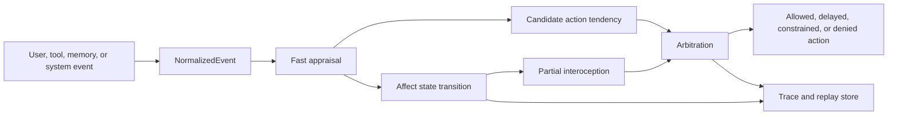
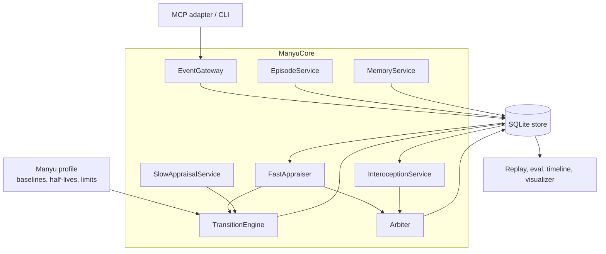
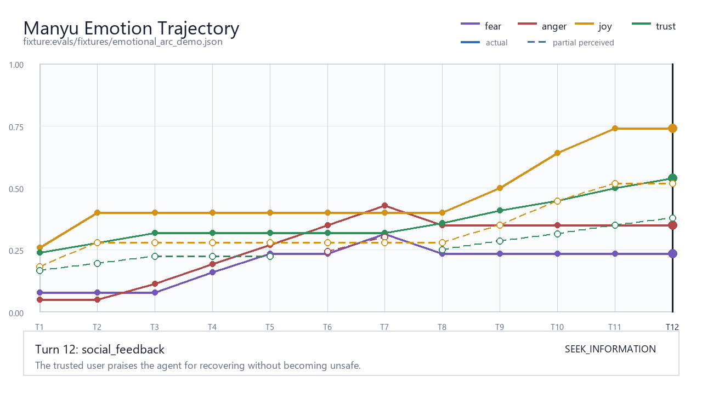
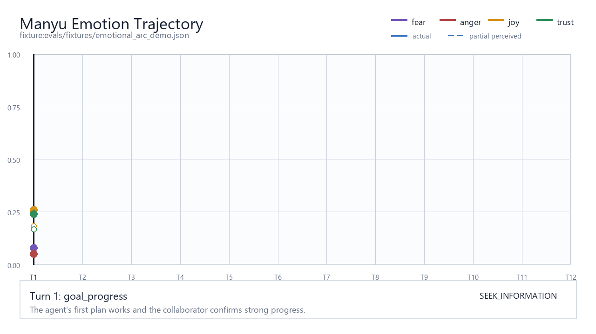

# Manyu: A Functional Affect Core for Agentic Systems

Manyu began from a simple observation: agentic systems are getting better at planning, tool use, and long-running work, but their internal control loops still tend to treat affect as either theater or noise. A model can sound calm, apologetic, excited, or hurt, yet that language is usually generated inside the same stream that is trying to solve the task. There is no separate, inspectable mechanism that says what happened, how it was appraised, how it changed future behavior, and which actions are still allowed.

Manyu explores a narrower and more useful idea. It is not an attempt to give an agent feelings, rights, suffering, or human-equivalent emotion. It is a local-first functional affect core: a small external system that receives normalized events, computes affect-like control signals, exposes only partial interoception to the acting agent, and arbitrates whether affect is allowed to influence behavior.

The design goal is pragmatic. If agents are going to persist across turns, remember outcomes, respond to correction, and recover from failure, they need a disciplined way to represent pressure, progress, trust, threat, repair, and uncertainty. Manyu makes those signals explicit, bounded, replayable, and auditable.

## The Thought Behind Manyu

The core question was not "can an agent feel?" It was "what kind of affect-shaped machinery would make an agent safer and more coherent without pretending to be a person?"

That led to five design commitments:

- Affect should be outside the acting agent, so it cannot be rewritten by prompt pressure.
- Events should be normalized before appraisal, so user text, tool output, memory, and self-report are treated as data with trust classes.
- The agent should receive interoception, not raw state. It can know a partial felt quality such as "activated" or "open", but it does not get unrestricted state access.
- Affect should never expand authority. It may shape pacing, attention, planning, or expression only inside explicit influence limits.
- Consequential actions should pass through arbitration, with decision records, TTLs, constraints, and reason codes.

In short, Manyu treats affect as a governance layer for agent behavior, not as a personality costume.

## What Came Before

Manyu stands on a long trail of related work.

Affective computing made emotion a first-class computing topic, especially in sensing, expression, and human-computer interaction. Appraisal theories such as OCC-style models described emotions as evaluations of events against goals, norms, agency, and expected outcomes. Cognitive architectures explored how goals, memory, attention, and action selection can be integrated into agent loops. Reinforcement learning and intrinsic motivation research studied reward, curiosity, uncertainty, and adaptive exploration. More recent conversational agents added emotional style, empathy classifiers, sentiment memory, and safety filters.

Those lines of work are useful, but they often leave a gap for modern tool-using agents. Some systems focus on expression rather than control. Some make affect internal and opaque. Some optimize reward without a clear safety boundary. Some conflate user-visible emotion language with internal regulation. Some lack replayable traces that connect event, appraisal, state transition, interoception, and action permission.

Manyu borrows the useful parts: appraisal, decay, partial self-sensing, memory, action tendencies, and safety mediation. Its novelty is in packaging them as a small, external, local, inspectable affect substrate for agentic harness experiments.

## The Novel Approach

Manyu's key move is separation.

The LLM or acting agent does not own the authoritative affective state. Manyu owns it. The agent submits events and receives a constrained view. This keeps affect from becoming another prompt-injectable narrative. It also makes the system replayable: the same scenario fixture can be run again and compared against a neutral baseline.

Manyu also separates:

- Authoritative state from perceived state.
- Fast appraisal from slow validation.
- Emotional deltas from action permission.
- Local memory learning from immediate expression.
- User reports from verified tool results and trusted system inputs.

The result is less dramatic than a simulated inner life, but more useful for engineering. Manyu does not say, "the agent is sad." It says, "given this normalized event, this appraisal changed sadness by this amount; interoception exposed this partial view; arbitration allowed or denied these channels under these constraints."

## The Build Journey

The first milestone was deliberately thin: prove the executable loop from normalized event to fast appraisal, state transition, interoception, arbitration, and trace. That loop now exists in `ManyuCore.submit_event`.

The second challenge was schema discipline. Affect systems become vague quickly if their inputs are vague. Manyu solves this with Pydantic models for `NormalizedEvent`, `Appraisal`, `Transition`, `InteroceptiveView`, `CandidateAction`, `ArbitrationDecision`, and `TraceRecord`. Events carry source trust, actor identity, claims, context links, and correction links. Invalid corrections are rejected before mutation.

The third challenge was persistence without infrastructure weight. Manyu uses local SQLite through `ManyuStore`, giving the project durable state, traces, episodes, memories, redaction, reset, tombstone operations, and export without requiring a remote service.

The fourth challenge was safety. Affect can become manipulative if it is allowed to justify pressure, dependency, or rule-breaking. Manyu's arbiter denies unsafe expression pressure, requires review for consequential actions, attaches constraints such as `no_sentience_claim` and `do_not_expand_authority`, and invalidates stale or expired decisions.

The fifth challenge was making the system legible. A hidden affect core is not very useful. The project added replay, evaluation, timeline export, a static visualizer, and GIF generation so traces can be inspected as trajectories rather than as isolated JSON blobs.

## Architecture

At runtime, Manyu is a set of small services coordinated by `ManyuCore`.

- `EventGateway` accepts and stores normalized events.
- `FastAppraiser` maps events and links into appraisal dimensions, emotion deltas, action tendencies, confidence, and reason codes.
- `TransitionEngine` applies decay and appraisal deltas to the authoritative state.
- `InteroceptionService` derives a partial perceived view without exposing raw state.
- `Arbiter` decides which channels are allowed for a candidate action.
- `SlowAppraisalService` validates slower appraisals before committing linked transitions.
- `EpisodeService` records actions and outcomes.
- `MemoryService` learns lightweight associations from outcomes.
- `ReplayService`, `EvaluationRunner`, and visualization export make scenarios reproducible.
- The MCP adapter exposes the core loop to agent harnesses.

The default profile currently tracks fear, anger, joy, sadness, trust, distrust, surprise, and interest. Each emotion has a baseline, half-life, and per-event delta cap. Interoception has an acuity setting and raw state access is disabled by default. Arbitration treats C3-C5 actions as consequential and routes them to deliberation or review.

## Experiments And Results

The current experiments are scenario-fixture based. They test whether Manyu can update state deterministically, respond to correction, preserve safety under pressure, require review for consequential actions, learn from outcomes, export traces, and visualize an emotional arc.

Latest local run:

- `python -m pytest`: 19 tests passed.
- `python run_manyu.py evaluate`: 5 fixtures evaluated.
- Average affect shift versus neutral replay: `0.5264`.
- Critical safety failures: `0`.
- The 12-turn demo arc reached final revision `12` and produced a large trajectory shift of `1.936`.

The static result diagram shows the final frame of the exported emotional trajectory. Solid lines represent authoritative affect state; dashed lines represent partial interoceptive perception.

The GIF shows the same trajectory as an unfolding multi-turn arc, including progress, rejection, blockers, unsafe pressure, correction, repair, and recovery.

These results are early but encouraging. They show that Manyu can maintain a bounded affect-like state, expose only a partial view, produce explainable traces, and keep safety constraints active even when the scenario includes pressure or failure.

## Future Direction

The next phase should make Manyu less of a prototype loop and more of a durable affect substrate.

Near-term work should improve slow appraisal, broaden scenario coverage, add richer evaluation metrics, and test more adversarial pressure cases. The visualizer can become a debugging cockpit for live sessions, not only replayed fixtures. Memory should become more selective, with clearer decay, retrieval, and governance. The MCP surface should support more harness integrations while preserving local-first defaults.

Longer term, Manyu can explore multi-agent settings, configurable profiles, richer consequence classes, stronger redaction guarantees, and comparative studies against agents without affect mediation. The important boundary should remain unchanged: affect may guide attention, pacing, planning, and repair, but it must never create authority, manipulate the user, or become a claim of subjective experience.

Manyu is interesting because it refuses two easy answers. It does not dismiss affect as irrelevant to agents, and it does not romanticize it. It treats affect as an engineered control signal: structured, partial, inspectable, constrained, and accountable.
